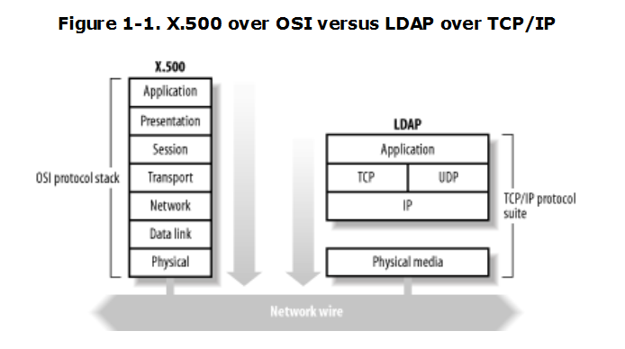
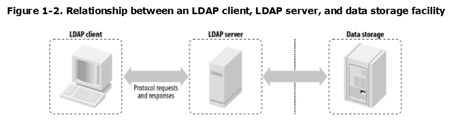

# Giới thiệu
----

**Lịch sử**
- Vào giữa thập niên 1980, Ủy ban tư vấn điện thoại - điện tín quốc tế (international telegraph and telephone consuitative committee - CCITT), tiền thân của Liên minh viễn thông quốc tế 
(International telecommunication union - ITU) và tổ chức tiêu chuẩn hóa quốc tế (international organization for standardization - IOS) đã hợp tác với nhau để tạo ra một chuẩn mới cho 
dịch vụ thư mục nhằm mục đích thống nhất nỗ lực của 2 tổ chức. Cuối năm 1988, CCITT đã công bố chuẩn dịch vụ thư mục X.500 đầu tiên. Sau đó chuẩn này được cập nhật vào các năm 1993, 
1997 và 2001.

- Khi mới xuất hiện, X.500 đã mang lại rất nhiều tiện ích cho người dùng. Nhưng dần dà, nó bộc lộ những khuyết điểm của mình. Một trong những khuyết điểm đó nằm ở giao thức DAP (Directory 
client Access Protocol - giao thức truy cập thư mục khách) của X.500. Giao thức này tương đối phức tạp, không thích hợp và không có sẵn trên các máy tính thời đó. Bên cạnh đó, DAP cũng 
khá cồng kềnh và khó hiện thực. Vì những lý do đó, người ta bắt đầu nghĩ đến một cách tiếp cận mới để tránh việc phải hiện thực một giao thức phức tạp như vậy. 

- Vào khoảng năm 1990, 2 giao thức đơn giản hóa của DAP, gọi là DAS (Directory Assistance Service) và DIXIE (Directory Interface to X.500 Implemented Efficiently) được định nghĩa lần lượt 
trong RFC1202 và RFC 1249.

- Sau sự ứng dụng thành công của DIXIE và DAS, các thành viên của OSI-DS quyết định tăng cường nguồn lực vào việc tạo ra một giao thức truy cập thư mục đơn giản hóa với đầy đủ tính năng cho 
X.500. Đó chính là LDAP.

# Giao thức LDAP
----

LDAP là một giao thức hướng thông điệp, Client tạo ra một thông điệp LDAP chứa một yêu cầu và gửi nó đến server. Server xử lý yêu cầu đó và gửi trả kết quả lại cho client theo một chuỗi gồm 
một hoặc nhiều thông điệp LDAP.

### Các khái niệm cơ bản

**Thư mục**: Một cách chung nhất, thư mục là nơi dùng để lưu trữ và cho phép thực hiện các thao tác truy nhập thông tin. Tuy vậy, có thể khái niệm này trùng với khái niệm cơ sở dữ liệu. 
Đối với một thư mục, các đặc điểm nổi bật để phân biệt với cơ sở dữ liệu là:
- Thư mục được thiết kế để phục vụ thao tác đọc hơn là thao tác ghi
- Thư mục cung cấp cái nhìn tĩnh về dữ liệu
- Các thao tác cập nhật trong thư mục là đơn giản, không có sự giàng buộc như trong cơ sở dữ liệu.

**Các dịch vụ thư mục**: Dịch vụ thư mục cho phép truy nhập thư mục, có thể qua các giao thức mạng. Thường thì các dịch vụ này còn cho phép nhân bản và phân bổ dữ liệu thư mục. 
Một ví dụ về dịch vụ thư mục là dịch vụ quản lý tên miền (Domain name system - DNS) cho phép ánh xạ một tên miền máy với một địa chỉ IP thích hợp. Các dịch vụ thư mục rất phong phú, có thể 
kể ra đây như dịch vụ vân tay hay dịch vụ mail,...

### LDAP

Trước hết, LDAP là một dịch vụ thư mục, nó là ngôn ngữ chung cho phép LDAP khách và chủ giao tiếp với nhau. Có thể liệt kê những đặc điểm nổi bật của giao thức này:
- là một giao thức mạng cho phép truy nhập các thông tin trong một thư mục.
- là một mô hình thông tin cho phép xác định cấu trúc và đặc điểm của thông tin trong thư mục.
- là một không gian tên cho phép xác định cách các thông tin được tham chiếu và tổ chức
- một mô hình các thao tác cho phép xác định cách tham chiếu và phân bổ dữ liệu 
- là một giao thức mở rộng
- là một mô hình thông tin mở rộng

# Intro to LDAP
----

Nếu bạn đang làm việc trong ngành máy tính, đây là cơ hội tốt để bạn tìm hiểu về LDAP từ bây giờ. Bạn sẽ kinh ngạc về những gì mà nó làm được. Bạn có muốn biết nhiều hơn về công nghệ 
tạo ra nó? Bạn đang đọc đúng tài liệu rồi đó. Trong phần giới thiệu này - loạt bài đầu tiên mô tả về cách thiết kế, thực thi và tích hợp môi trường LDAP và trong công ty của bạn. 
Giúp bạn hiểu về tư tưởng bên trong của LDAP ở các phần tiếp theo.

Trước tiên, chuyện gì đang diễn ra với LDAP trong cuộc sống bận rộn ngày nay. Một công ty thực thi LDAP trong hầu hết các ứng dụng, trên mọi nền tảng máy tính, để chứa các thông tin từ thư 
mục LDAP của bạn. Thư mục đó có thể được sử dụng để lưu trữ một lượng lớn dữ liệu: địa chỉ email và thông tin định tuyến, dữ liệu HR, public security keys, contact list và nhiều cái khác. 

Đợi chút, bạn đang sử dụng một Oracle, Sysbase, Informix, Microsoft SQL database để lưu trữ dữ liệu tương tự. LDAP khác biệt thế nào? điều gì làm nó tốt hơn? Mời đọc tiếp

### LDAP là gì?
----

Lightweight Directory Access Protocol, được biết như LDAP, dựa theo chuẩn X.500 nhưng đơn giản và dễ dàng tùy chỉnh hơn. Không như X.500, LDAP hỗ trợ TCP/IP để truy cập Internet

# Giới thiệu chung về LDAP
----

Hiện nay, để xây dựng các hệ thống lớn, điều tối quan trọng là phải làm cách nào để có thể tích hợp dữ liệu; để từ đó có thể sử dụng chung giữa các hệ thống khác nhau. 
Trong đó, tích hợp tài khoản mà người dùng sử dụng là vấn đề cần thiết nhất.

Hãy tưởng tượng một hệ thống có khoảng 5-6 module khác nhau, mỗi module lại được thiết kế trên một nền tảng khác nhau, cần có một hệ thống người dùng khác nhau. Vậy thì với mỗi module, 
người sử dụng cần phải có một Username và mật khẩu khác nhau, đó là điều không thể chấp nhận được. Người dùng chẳng mấy chốc mà chán ghét hệ thống.

Làm cách nào để có thể tích hợp được người dùng giữa các hệ thống trên? Câu trả lời là LDAP. Vậy LDAP là gì?

## Định nghĩa về LDAP
----

LDAP (Lightweight Directory Access Protocol) - là giao thức truy cập nhanh các dịch vụ thư mục - là một chuẩn mở rộng cho các nghi thức truy cập thư mục.

LDAP là một giao thức tìm, truy nhập các thông tin dạng thư mục trên Server. Nó dùng giao thức dạng Client/Server để truy cập dịch vụ thư mục.

LDAP chạy trên TCP/IP hoặc các dịch vụ hướng kết nối khác

LDAP được tạo ra cho các hành động đọc, bởi thế, xác thực người dùng bằng phương tiện tìm kiếm LDAP nhanh, hiệu suất, tốn ít tài nguyên, đơn giản hơn là query 1 user account trên CSDL.

Có các LDAP Server như: OpenLDAP, OPENDS, Active Directory,...

### Giải thích Lightweight
----

Tại sao LDAP được coi là lightweight? Lightweight được so sánh với cái gì? Để trả lời câu hỏi này, bạn cần tìm hiểu nguồn gốc của LDAP.

Bản chất của LDAP là một phần của dịch vụ thư mục X.500. LDAP thực chất được thiết kế như một giao thức nhẹ nhàng, dùng như gateway trả lời những yêu cầu của X.500 server.

X.500 được biết tới như một heavyweight, là một tập các chuẩn. Nó yêu cầu client và server liên lạc với nhau sử dụng theo mô hình OSI. Mô hình 7 tầng của OSI - mô hình chuẩn - phù hợp 
trong thiết kế với giao thức mạng, nhưng khi so sánh với chuẩn TCP/IP thì nó trở lên không còn hợp lý.

LDAP được so sánh với lightweight vì nó sử dụng gói tin overhead thấp, nó được xác định chính xác trên lớp TCP (mặc định cổng 389) của danh sách các giao thức TCP/IP. Còn X.500 
là một lớp giao thức ứng dụng, nó chứa nhiều thứ hơn, ví dụ như các network header bao quanh gói tin ở mỗi layer trước khi nó được chuyển đi trong mạng.

Tóm lại, LDAP được coi là *lightweight* bởi vì nó đã lược bỏ rất nhiều những phương thức ít được sử dụng của X.500

### Giải thích  Directory
----

Không nên nhầm giữa dịch vụ thư mục với một cơ sở dữ liệu. Thư mục được thiết kế để đọc nhiều hơn là để ghi vào, còn đối với cơ sở dữ liệu, nó phù hợp với cả công việc đọc và ghi một 
cách thường xuyên và lặp đi lặp lại.

LDAP chỉ là một giao thức, nó là một tập những thông tin cho việc xử lý các loại dữ liệu. Một giao thức không thể biết dữ liệu được lưu trữ ở đâu. LDAP không hỗ trợ sự xử lý và những đặc 
trưng khác như của cơ sở dữ liệu. 

Client sẽ không bao giờ thấy được hoặc biết rằng có một bộ máy lưu trữ backend. Vì lý do này, LDAP client cần liên lạc với LDAP server theo mô hình chuẩn sau:

### Access Protocol
----

LDAP là một giao thức truy cập. Nó đưa ra mô hình dạng cây dữ liệu, và mô hình dạng cây này được nhắc tới khi bạn truy cập một LDAP server.

Giao thức truy cập client-server của LDAP được định nghĩa trong RFC, một client có thể đưa ra một loạt những yêu cầu và những trả lời cho những yêu cầu đó lại được trả lời 
theo những cách sắp xếp khác nhau.

## Phương thức hoạt động của LDAP

# Tham khảo
- [https://vi.wikipedia.org/wiki/Lightweight_Directory_Access_Protocol](https://vi.wikipedia.org/wiki/Lightweight_Directory_Access_Protocol)
- [https://moodle.org/mod/forum/discuss.php?d=22958](https://moodle.org/mod/forum/discuss.php?d=22958)
- [http://ldapman.org/articles/intro_to_ldap.html](http://ldapman.org/articles/intro_to_ldap.html)
- [https://vi.scribd.com/doc/109951012/L%C3%9D-THUY%E1%BA%BET-V%E1%BB%80-LDAP-VA-%E1%BB%A8NG-D%E1%BB%A4NG-TRONG-CAC-D%E1%BB%8ACH-V%E1%BB%A4-M%E1%BA%A0NG-LINUX](https://vi.scribd.com/doc/109951012/L%C3%9D-THUY%E1%BA%BET-V%E1%BB%80-LDAP-VA-%E1%BB%A8NG-D%E1%BB%A4NG-TRONG-CAC-D%E1%BB%8ACH-V%E1%BB%A4-M%E1%BA%A0NG-LINUX)
