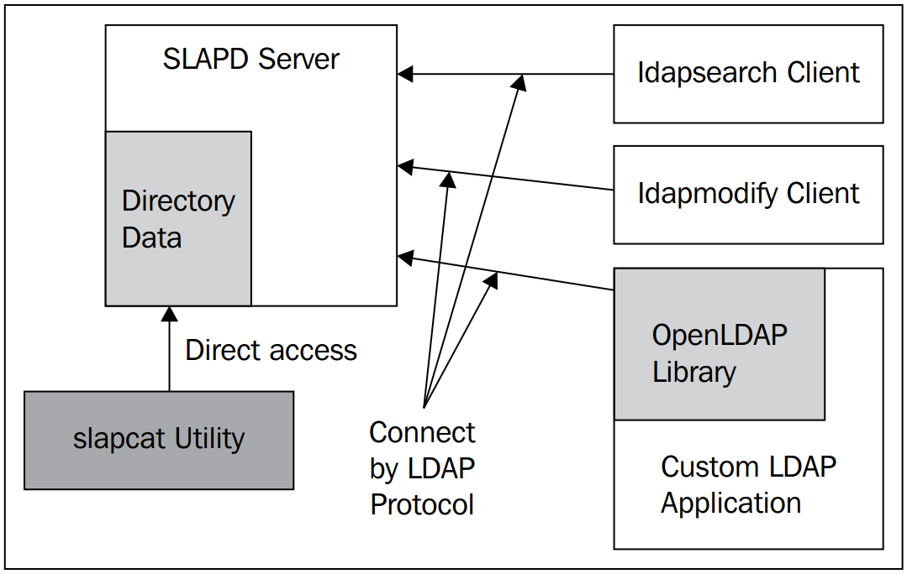

# Giới thiệu
----
Trong phần này, tôi sẽ trình bày về OpenLDAP để giúp mọi người có một cái nhìn rõ hơn về giao thức LDAP. 

OpenLDAP là một Open source cung cấp dịch vụ thư mục. Các thư mục có thể được sử dụng để lưu trữ thông tin tập trung, và các thông tin này sử dụng cho việc xác thực.
Các máy trạm có thể kết nối tới OpenLDAP bằng cách sử dụng Lightweight Directory Access Protocol (LDAP). Máy trạm có thể tìm kiếm, chỉnh sửa hoặc lấy các bản ghi trong thư mục. 
LDAP server thường được sử dụng làm dịch vụ xác thực người dùng. Nhưng ngoài ra còn có rất nhiều ứng dụng khác của LDAP, như sử dụng làm danh bạ địa chỉ, DNS database, công cụ tổ chức, hay thậm chí là ứng dụng lưu trữ đối tượng mạng.

# Các kiến thức cần nắm về LDAP
----
Để hiểu về LDAP bạn cần phải nắm được các vấn đề sau:
- Directory là gì?
- The structure of a Directory Entry
- A unique Name: The DN
- An Example LDAP Entry
- The Object Class Attribute
- Operational Attributes
- The Directory Infomation Tree

Phần này bạn có thể tham khảo tại [đây](https://github.com/hocchudong/ghichep-LDAP/blob/master/docs/TanNT-LDAP-Understanding.md) để nắm được các khái niệm. 
Tiếp theo tôi sẽ đi sâu vào ứng dụng OpenLDAP

# A Technical Overview of OpenLDAP
----
OpenLDAP có thể được chia thành 4 thành phần:
- Servers: Cung cấp dịch vụ LDAP
- Clients: Lấy dữ liệu LDAP
- Utinities: Hỗ trợ LDAP server
- Libraries: Cung cấp giao diện lập trình cho LDAP



**The Server**: Thành phần chính trong LDAP là SLAPD (the Stand-Alone LDAP Daemon) cung cấp truy nhập cho một hoặc nhiều cây thư mục.

**Client**: Client thông qua giao thức LDAP để kết nối tới Server

# Installation and Configuration
----
- Daemons (Server): slapd và slurpd
- Client applications: ldapsearch, ldapadd, ldapmodify,...
- Supporting Utilities: slapcat, slapauth,...
- Libraries: libldap

**Note**: Phần cài đặt bạn có thể tham khảo tại [đây](https://github.com/hocchudong/ghichep-LDAP/blob/master/openLDAP/install.md)

## Configuring the SLAPD Server
----
Chúng ta có 02 daemon: SLURPD và SLAPD

SLAPD là một trong những file cấu hình chính cho mọi file cấu hình bổ trợ. đường dẫn tại `/usr/share/slapd/slapd.conf`. 

Trong file cấu hình này, được chia làm 3 phần chính: BASIC, DATABASE và ACLs

BASIC
```sh
include         /etc/ldap/schema/core.schema
include         /etc/ldap/schema/cosine.schema
include         /etc/ldap/schema/nis.schema
include         /etc/ldap/schema/inetorgperson.schema
pidfile         /var/run/slapd/slapd.pid
argsfile        /var/run/slapd/slapd.args
loglevel        none
modulepath      /usr/lib/ldap
moduleload      back_hdb
sizelimit 500
tool-threads 1
backend         hdb
```
Chỉ dẫn cho server lấy các thông tin schema. lưu trữ thông tin tiến trình

DATABASE
```sh
database        hdb
suffix          "dc=test,dc=com"
directory       "/var/lib/ldap"
dbconfig set_cachesize 0 2097152 0
dbconfig set_lk_max_objects 1500
dbconfig set_lk_max_locks 1500
dbconfig set_lk_max_lockers 1500
index           objectClass eq
lastmod         on
checkpoint      512 30
```

ACL
```sh
access to attrs=userPassword,shadowLastChange
        by anonymous auth
        by self write
        by * none
access to dn.base="" by * read
access to *
        by self write
        by * read
```

Cấp quyền truy cập
```sh
access to [resources]
	by [who] [type of access granted]
	by [who] [type of access granted]
	by [who] [type of access granted]
```

## Configuring the LDAP Clients

Chỉnh sửa trong file cấu hình của client cài LDAP `/etc/ldap/ldap.conf` một số nội dung sau
```sh
BASE	dc=test,dc=com
URI	ldap://test.com ldap://test.com:666
BINDDN	cn=admin,dc=test,dc=com
SIZELIMIT	0
TIMELIMIT	0
TLS_CACERT	/etc/ssl/certs/ca-certificates.crt
```

Giải thích một số tham số:
- URI: chỉ cho client kết nối tới server, nhiều địa chỉ thì cách nhau bằng khoảng trắng
- BASE: Chỉ cho client nơi bắt đầu tìm kiếm trong thư mục
- BINDDN: Chỉ định một DN cụ thể khi kết nối tới server
- sizelimit và timelimit: chỉ ra số bản ghi và thời gian đợi server phản hồi.

## Testing to Server

lệnh tham khảo
```sh
# ldapsearch -H ldap://test.com -x -W -D 'cn=admin,dc=test,dc=com' -s base

# ldapsearch -x -w tan124 -H ldap://test.com -D 'cn=admin,dc=test,dc=com' -b 'ou=users,dc=test,dc=com' '(uid=unguyen)'
```

lệnh xóa một entry
```sh
#  ldapdelete -D 'cn=admin,dc=test,dc=com' -w tan124 "uid=tannt,ou=people,dc=test,dc=com"
```

# LDAP xác thực user Ubuntu

Trong phần này, tôi sẽ thực hiện cài đặt và cấu hình OpenLDAP để tạo user cho người dùng trên các máy Ubuntu

## Cài đặt LDAP Server
----
- Thực hiện cài đặt openldap, trong quá trình cài đặt cần nhập password cho admin entry
```sh
# apt-get -y install slapd ldap-utils
```

- Kiểm tra kết quả cài đặt
```sh
# slapcat
```
	Câu lệnh trên sẽ show ra kết quả một cây thư mục mặc định.
	
- Thực hiện cài đặt gói cấu hình bằng lệnh
```sh
# apt-get install libnss-ldap -y
```

Trong quá trình cài đặt gói trên, sẽ yêu cầu thiết lập cấu hình, thực hiện điều chỉnh như sau:
```sh
ldap://vnptdata.vn
dc=vnptdata,dc=vn
ldapversion: 3
Make local root Database admin: No
Does the LDAP database require login? No
Local crypt to use when changing passwords: md5
```

- Có thể thực hiện tùy chỉnh lại cấu hình bằng lệnh hoặc sửa file `vi /etc/ldap.conf`
```sh
# dpkg-reconfigure ldap-auth-config
```

- Để thay đổi các cài đặt của LDAP, sử dụng lệnh
```sh
dpkg-reconfigure slapd
```

- Khi chạy lệnh trên sẽ cho phép bạn tùy chỉnh lại cài đặt trên cây thư mục, bạn chọn như sau
```sh
Omit OpenLDAP server configuration? No
DNS domain name? vnptdata.vn
Organization name? vnptdata
Administrator password? 123456
Database backend to use? HDB
Remove the database when slapd is purged? No
Move old database? Yes
Allow LDAPv2 protocol? No
```
	
- Tạo một nhánh của cây thư mục `vi base.ldif` với nội dung sau:
```sh
dn: ou=people,dc=vnptdata,dc=vn
objectClass: organizationalUnit
ou: people

dn: ou=groups,dc=vnptdata,dc=vn
objectClass: organizationalUnit
ou: groups
```

- Thực hiện add nhánh vào cây thư mục, nhập pass sau khi chạy lệnh
```sh
# ldapadd -x -D cn=admin,dc=vnptdata,dc=vn -W -f base.ldif
```

- Thêm một user vào OpenLDAP, đầu tiên thực hiện sinh ra một password dạng mã hóa bằng lệnh. Tôi nhập vào pass là 123456
```sh
# slappasswd
New password: 
Re-enter new password: 
{SSHA}vcLSDERW1e0hjroVnjj/4atYlSyLeNun
```

- Tạo ra một tập tin `vi ldapuser.ldif` để thêm thông tin vào cây thư mục với nội dung sau:
```sh
dn: uid=ubuntu,ou=people,dc=vnptdata,dc=vn
objectClass: inetOrgPerson
objectClass: posixAccount
objectClass: shadowAccount
cn: ubuntu
sn: ubuntu
userPassword: {SSHA}vcLSDERW1e0hjroVnjj/4atYlSyLeNun
loginShell: /bin/bash
uidNumber: 1000
gidNumber: 1000
homeDirectory: /home/ubuntu

dn: cn=ubuntu,ou=groups,dc=vnptdata,dc=vn
objectClass: posixGroup
cn: ubuntu
gidNumber: 1000
memberUid: ubuntu
```

- Thực hiện thêm thông tin từ tập tin trên vào cây thư mục, nhập password sau khi chạy lệnh.
```sh
# ldapadd -x -D cn=admin,dc=vnptdata,dc=vn -W -f ldapuser.ldif
```

- Thêm user và group từ local vào cây thư mục LDAP, đầu tiên tạo script để tách thông tin. `vi ldapuser.sh`
```sh
#!/bin/bash

SUFFIX='dc=vnptdata,dc=vn'
LDIF='ldapuser.ldif'

echo -n > $LDIF
GROUP_IDS=()
grep "x:[1-9][0-9][0-9][0-9]:" /etc/passwd | (while read TARGET_USER
do
    USER_ID="$(echo "$TARGET_USER" | cut -d':' -f1)"

    USER_NAME="$(echo "$TARGET_USER" | cut -d':' -f5 | cut -d' ' -f1,2)"
    [ ! "$USER_NAME" ] && USER_NAME="$USER_ID"

    LDAP_SN="$(echo "$USER_NAME" | cut -d' ' -f2)"

    LASTCHANGE_FLAG="$(grep "${USER_ID}:" /etc/shadow | cut -d':' -f3)"
    [ ! "$LASTCHANGE_FLAG" ] && LASTCHANGE_FLAG="0"

    SHADOW_FLAG="$(grep "${USER_ID}:" /etc/shadow | cut -d':' -f9)"
    [ ! "$SHADOW_FLAG" ] && SHADOW_FLAG="0"

    GROUP_ID="$(echo "$TARGET_USER" | cut -d':' -f4)"
    [ ! "$(echo "${GROUP_IDS[@]}" | grep "$GROUP_ID")" ] && GROUP_IDS=("${GROUP_IDS[@]}" "$GROUP_ID")

    echo "dn: uid=$USER_ID,ou=People,$SUFFIX" >> $LDIF
    echo "objectClass: inetOrgPerson" >> $LDIF
    echo "objectClass: posixAccount" >> $LDIF
    echo "objectClass: shadowAccount" >> $LDIF
    echo "sn: $LDAP_SN" >> $LDIF
    echo "givenName: $(echo "$USER_NAME" | awk '{print $1}')" >> $LDIF
    echo "cn: $USER_NAME" >> $LDIF
    echo "displayName: $USER_NAME" >> $LDIF
    echo "uidNumber: $(echo "$TARGET_USER" | cut -d':' -f3)" >> $LDIF
    echo "gidNumber: $(echo "$TARGET_USER" | cut -d':' -f4)" >> $LDIF
    echo "userPassword: {crypt}$(grep "${USER_ID}:" /etc/shadow | cut -d':' -f2)" >> $LDIF
    echo "gecos: $USER_NAME" >> $LDIF
    echo "loginShell: $(echo "$TARGET_USER" | cut -d':' -f7)" >> $LDIF
    echo "homeDirectory: $(echo "$TARGET_USER" | cut -d':' -f6)" >> $LDIF
    echo "shadowExpire: $(passwd -S "$USER_ID" | awk '{print $7}')" >> $LDIF
    echo "shadowFlag: $SHADOW_FLAG" >> $LDIF
    echo "shadowWarning: $(passwd -S "$USER_ID" | awk '{print $6}')" >> $LDIF
    echo "shadowMin: $(passwd -S "$USER_ID" | awk '{print $4}')" >> $LDIF
    echo "shadowMax: $(passwd -S "$USER_ID" | awk '{print $5}')" >> $LDIF
    echo "shadowLastChange: $LASTCHANGE_FLAG" >> $LDIF
    echo >> $LDIF
done

for TARGET_GROUP_ID in "${GROUP_IDS[@]}"
do
    LDAP_CN="$(grep ":${TARGET_GROUP_ID}:" /etc/group | cut -d':' -f1)"

    echo "dn: cn=$LDAP_CN,ou=Groups,$SUFFIX" >> $LDIF
    echo "objectClass: posixGroup" >> $LDIF
    echo "cn: $LDAP_CN" >> $LDIF
    echo "gidNumber: $TARGET_GROUP_ID" >> $LDIF

    for MEMBER_UID in $(grep ":${TARGET_GROUP_ID}:" /etc/passwd | cut -d':' -f1,3)
    do
        UID_NUM=$(echo "$MEMBER_UID" | cut -d':' -f2)
        [ $UID_NUM -ge 1000 -a $UID_NUM -le 9999 ] && echo "memberUid: $(echo "$MEMBER_UID" | cut -d':' -f1)" >> $LDIF
    done
    echo >> $LDIF
done
)
```

- Thực hiện chạy script trên bằng lệnh `bash ldapuser.sh` sẽ tạo ra một tập tin `ldapuser.ldif` với thông tin là các user local của hệ điều hành. thêm vào cây thư mục LDAP bằng lệnh:
```sh
# ldapadd -x -D cn=admin,dc=vnptdata,dc=vn -W -f ldapuser.ldif
```

- Để xóa user và group trong nhánh cây thư mục LDAP vừa add, thực hiện chạy lệnh `slapcat` để tìm đúng dn, sau đó chạy lệnh sau để xóa:
```sh

root@ubuntu:~# ldapdelete -x -W -D 'cn=admin,dc=vnptdata,dc=vn' "uid=ubuntu,ou=people,dc=vnptdata,dc=vn" 
Enter LDAP Password:
root@ubuntu:~# ldapdelete -x -W -D 'cn=admin,dc=vnptdata,dc=vn' "cn=ubuntu,ou=groups,dc=vnptdata,dc=vn" 
Enter LDAP Password:
```

## Cài đặt LDAP client
----
- Thực hiện cài đặt các gói cần thiết bằng lệnh sau:
```sh
# apt-get -y install libnss-ldap libpam-ldap ldap-utils
```

Trong quá cài đặt sẽ yêu cầu thiết lập cấu hình chỉ định LDAP serrver
```sh
ldap://example.vnptdata.vn/
dc=vnptdata,dc=vn
LDAP version: 3
Make local root Database admin: Yes
Does the LDAP database require login? No
LDAP account for root:	 cn=admin,dc=vnptdata,dc=vn
LDAP root account password:	
```
	
Lưu ý đặt host cho file sau: `vi /etc/hosts` để client kết nối được tới LDAP server bằng domain name
```sh
172.16.69.250	example.vnptdata.vn
```
	
- Chỉnh sửa lại tập tin cấu hình login cho user login vào client. `vi /etc/nsswitch.conf`
```sh
passwd:     compat ldap
group:     compat ldap
shadow:     compat ldap
```

- Chỉnh sửa lại cấu hình của pam cho việc xác thực. `vi /etc/pam.d/common-password`
```sh
# line 26: change ( remove 'use_authtok' )
password     [success=1 user_unknown=ignore default=die]     pam_ldap.so try_first_pass
```

- `vi /etc/pam.d/common-session`
```sh
# add to the end if need ( create home directory automatically at initial login )
 session optional        pam_mkhomedir.so skel=/etc/skel umask=077
```

- Khởi động lại LDAP bằng lệnh:
```sh
# /etc/init.d/libnss-ldap restart
```

- Thực hiện login thử bằng user ubuntu mà ta vừa add bên LDAP server lúc trước với pass 123456, sẽ thấy login thành công và sinh ra một home directory /home/ubuntu mặc dù kiểm 
tra trong file /etc/passwd không hề có user ubuntu này.

## Add TLS

- Để nâng cao tính năng bảo mật ta cần thực hiện mã hóa đường truyền bằng TLS giữa client và server.

Trong phần này, tôi sẽ cấu hình LDAP sử dụng tls để mã hóa đường truyền.

Đầu tiên, trên LDAP server ta sử dụng openssl gen key cho việc mã hóa cũng như import vào LDAP tree

- Nếu LDAP server chưa có openssl thì cài gói sau, nhưng hầu hết các distro đều cài mặc định openssl.
```sh
apt-get install openssl
```

- Ta thêm đường dẫn sau vào PATH của hệ điều hành, để có thể sử dụng script CA.sh gen key
```sh
export PATH=$PATH:/usr/lib/ssl/misc
```

- Tùy chỉnh lại các thông tin cấu hình trong file `/usr/lib/ssl/openssl.cnf` như sau
```sh
...
[ req ]
default_bits    = 2048
...
[ req_distinguished_name ]
countryName_default		= VN
stateOrProvinceName_default	= HaNoi
0.organizationName_default	= VNPT DATA
...
```

- Tạo thư mục để lưu các khóa
```sh
mkdir ~/ca && cd ~/ca
```

- Bây giờ ta tạo một file CA mới như sau:
```
ldap1:~/ca# CA.sh -newca
CA certificate filename (or enter to create)

Making CA certificate ...
Generating a 2048 bit RSA private key
............+++
........+++
writing new private key to './demoCA/private/./cakey.pem'
Enter PEM pass phrase: **************
Verifying - Enter PEM pass phrase: **************
...
Country Name (2 letter code) [UA]:VN
State or Province Name (full name) [LV]:HaNoi
Locality Name (eg, city) []:HaNoi
Organization Name (eg, company) [XYZ Co]:VNPT DATA
Organizational Unit Name (eg, section) []: SI
Common Name (eg, YOUR name) []:vnptdata.vn
Email Address []:nguyentrongtan@vnpt.vn

Please enter the following 'extra' attributes
to be sent with your certificate request
A challenge password []:123456
An optional company name []:VNPT DATA
Using configuration from /usr/lib/ssl/openssl.cnf
Enter pass phrase for ./demoCA/private/./cakey.pem: *****
Check that the request matches the signature
Signature ok
Certificate Details:
...
Write out database with 1 new entries
Data Base Updated
```

- Kết quả của lệnh trên sẽ tạo ra một tập tin certificate tên là `cacert.pem` trong thư mục `~/ca/demoCA`. Ta gán lại quyền đọc cho thư mục gen key như sau:
```sh
chmod -R go-rwx ~/ca
```

- Sau khi tạo được tập tin certificate như trên, ta phải thực hiện tiếp 02 bước sau:
	- create certificate request
	- sign request by certificate authority. bước này sử dụng certificate `cacert.pem` vừa tạo được ở trên

- Certificate Request
```sh
ldap1:~/ca# openssl req -new -nodes -keyout newreq.pem -out newreq.pem
Generating a 2048 bit RSA private key
.....................+++
....................................+++
writing new private key to 'newreq.pem'
...
Country Name (2 letter code) [UA]: VN
State or Province Name (full name) [LV]:HN
Locality Name (eg, city) []:HaNoi
Organization Name (eg, company) [XYZ Co]:VNPT DATA
Organizational Unit Name (eg, section) []:
Common Name (eg, YOUR name) []:vnptdata.vn
Email Address []:nguyentrongtan@vnpt

Please enter the following 'extra' attributes
to be sent with your certificate request
A challenge password []:123456
An optional company name []:VNPT DATA
```

- sign request
```sh
ldap1:~/ca# /usr/lib/ssl/misc/CA.sh -sign
Using configuration from /usr/lib/ssl/openssl.cnf
Enter pass phrase for ./demoCA/private/cakey.pem: 123456
Check that the request matches the signature
Signature ok
Certificate Details:
...       
Certificate is to be certified until XXX (365 days)
Sign the certificate? [y/n]:y

1 out of 1 certificate requests certified, commit? [y/n]y
Write out database with 1 new entries
Data Base Updated
Certificate:
    ...
Signed certificate is in newcert.pem
```

- Sau 02 bước trên, chúng ta đã tạo ra được 02 tập tin: `newreq.pem` và `newcert.pem`. Chúng ta có thể đổi tên thành ldap-key.pem và ldap-cert.pem để 
sử dụng. hoặc có thể kết hợp 02 tập tin thành một như sau:
```sh
cat newreq.pem newcert.pem > new.pem
```

- Sau khi tạo xong key, bây giờ tới bước gắn key vào LDAP server và cấu hình CA cho client kết nối tới.

- Trên LDAP server, chúng ta cài đặt CA certificate như sau:
```sh
cp ~/ca/demoCA/cacert.pem /etc/ssl/certs/
chmod go+r /etc/ssl/certs/cacert.pem
```

- Copy ldap key and certificate files to /etc/ldap/ssl
```sh
mkdir /etc/ldap/ssl/
cp ~/ca/new*.pem /etc/ldap/ssl/
```

- Secure certificates:
```sh
ldap1:~# chown -R root:openldap /etc/ldap/ssl
ldap1:~# chmod -R o-rwx /etc/ldap/ssl
```

- Chỉnh sửa tập tin cấu hình `/etc/default/slapd` cho phép LDAP sử dụng kết nối bảo mật
```sh
LAPD_SERVICES="ldap://127.0.0.1:389/ ldaps:/// ldapi:///"
```

- Tạo một tập tin cấu hình cho LDAP `tls-config.ldif` nội dung sau:
```sh
dn: cn=config
add: olcTLSCACertificateFile
olcTLSCACertificateFile: /etc/ssl/certs/cacert.pem
-
add: olcTLSCertificateFile
olcTLSCertificateFile: /etc/ldap/ssl/newcert.pem
-
add: olcTLSCertificateKeyFile
olcTLSCertificateKeyFile: /etc/ldap/ssl/newreq.pem
```

- Apply it:
```sh
ldapmodify -QY EXTERNAL -H ldapi:/// -f tls-config.ldif
```

- Restart slapd:
```sh
/etc/init.d/slapd restart
```

- Ensure started:
```sh
netstat -tunlp | grep slapd
tcp        0      0 0.0.0.0:636             0.0.0.0:*               LISTEN      2462/slapd      
tcp        0      0 127.0.0.1:389           0.0.0.0:*               LISTEN      2462/slapd  
```

## Client

Ta gửi file CA certificate `cacert.pem` từ Server sang client.

- Sửa lại một vài tham số trong tập tin `/etc/ldap/ldap.conf` ở client, chỉ để lại dòng sau:
```sh
TLS_REQCERT allow
```

- Kiểm tra lại xem đã làm việc chưa
```sh
ldapsearch -x
```

- Hoặc login lại và bắt gói tin trên LDAP server bằng `tcpdump`
```sh
tcpdump -ne -i any host 172.16.68.13
```

# Tham khảo
- [https://www.google.com.vn/url?sa=t&rct=j&q=&esrc=s&source=web&cd=2&cad=rja&uact=8&ved=0ahUKEwi_uYLi55jRAhUDG5QKHdZoBj4QFgggMAE&url=https%3A%2F%2Ftazlambert.files.wordpress.com%2F2008%2F05%2Fpacktpublishingmasteringopenldapaug20071847191029.pdf&usg=AFQjCNFh_nemlQgtx5FQINp_LbajJ3TtPQ&sig2=RhzCm_KbeMhXKDaNvAbeBw](https://www.google.com.vn/url?sa=t&rct=j&q=&esrc=s&source=web&cd=2&cad=rja&uact=8&ved=0ahUKEwi_uYLi55jRAhUDG5QKHdZoBj4QFgggMAE&url=https%3A%2F%2Ftazlambert.files.wordpress.com%2F2008%2F05%2Fpacktpublishingmasteringopenldapaug20071847191029.pdf&usg=AFQjCNFh_nemlQgtx5FQINp_LbajJ3TtPQ&sig2=RhzCm_KbeMhXKDaNvAbeBw)
- [https://www.server-world.info/en/note?os=Ubuntu_14.04&p=ldap&f=1](https://www.server-world.info/en/note?os=Ubuntu_14.04&p=ldap&f=1)
- [https://www.digitalocean.com/community/tutorials/how-to-authenticate-client-computers-using-ldap-on-an-ubuntu-12-04-vps](https://www.digitalocean.com/community/tutorials/how-to-authenticate-client-computers-using-ldap-on-an-ubuntu-12-04-vps)
- [https://mindref.blogspot.com/2010/12/openssl-ca.html](https://mindref.blogspot.com/2010/12/openssl-ca.html)
- [https://mindref.blogspot.com/2010/12/openssl-create-certificates.html](https://mindref.blogspot.com/2010/12/openssl-create-certificates.html)
- [https://mindref.blogspot.com/2010/12/debian-openldap-ssl-tls-encryption.html](https://mindref.blogspot.com/2010/12/debian-openldap-ssl-tls-encryption.html)
