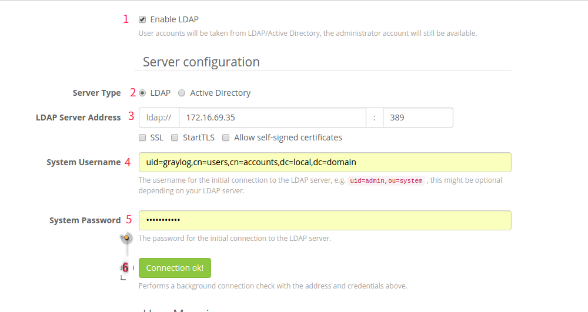
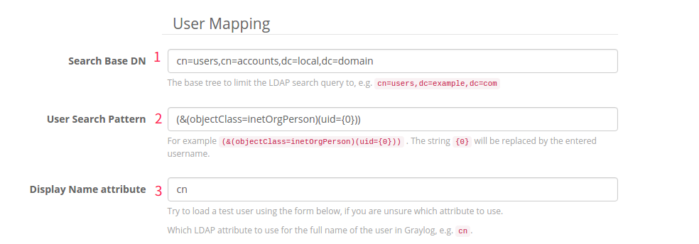
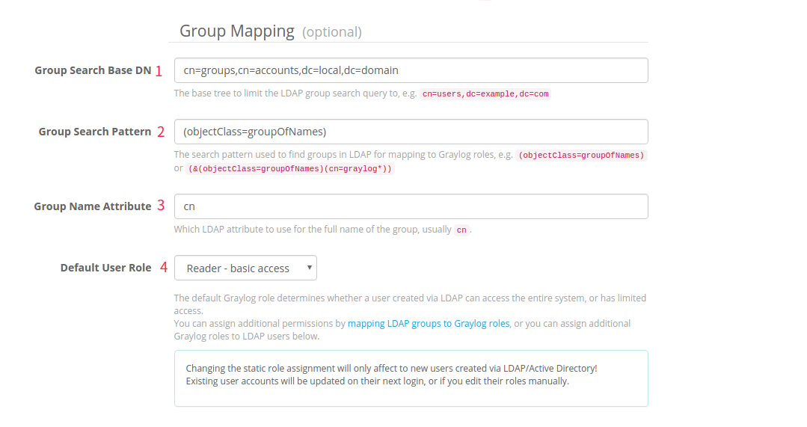
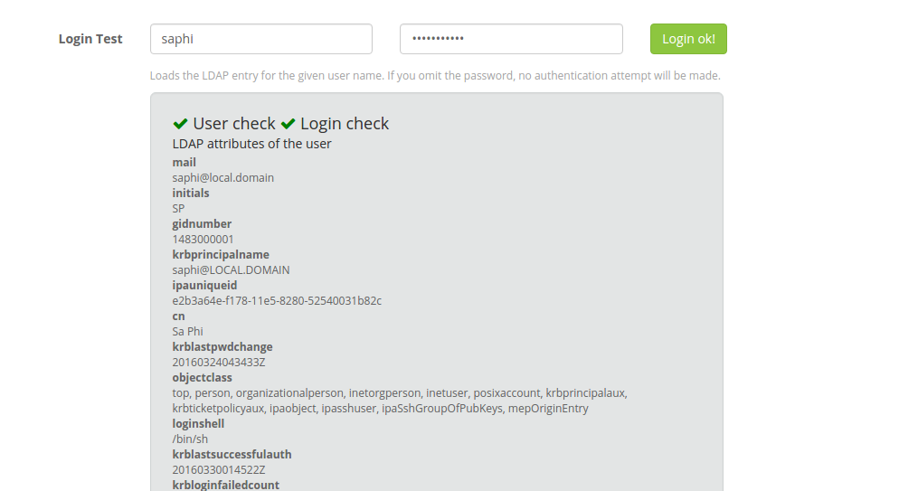

###Cấu hình xác thực graylog sử dụng FreeIPA
- Để cấu hình xác thực trên graylog sử dụng FreeIPA ta cần tạo một user `graylog` để thực hiện việc kết nối tới FreeIPA

- Login vào Server chạy FreeIPA

- Lấy ticket cho admin

`kinit admin`

- Nhập password admin

- Tạo user `graylog`

`ipa user-add graylog --first Graylog --last Monitoring --password`

- Nhập 2 lần password cho user `graylog`

- Đăng nhập vào graylog Web UI

- Chọn **System -> User -> Configure LDAP**

######Server Configure

- Cấu hình như hình bên dưới

  - 1: Tick chọn enable LDAP
  - 2: Chọn LDAP
  - 3: Nhập IP và port của FreeIPA Server. Nếu bạn sử dụng ldaps thì nhập port 636 và tick chọn SSL bên dưới. Nếu không nhập port 389 như hình
  - 4: nhập user `graylog`, uid là id của user, cn là common name, dc là domain của FreeIPA. Để lấy thông tin này ta có thể dùng lệnh `ldapsearch -x uid=graylog`
  - 5: Password user `graylog` đã tạo ở trên
  - 6: Kiểm tra kết nối tới FreeIPA Server. Nếu Test Ok là ta đã xong bước cấu hình này. Nếu failed kiểm tra lại các cấu hình cho đúng

######User Mapping

- Cấu hình như hình bên dưới

  - 1: Base DN để giới hạn LDAP query tới LDAP Server
  - 2: Mẫu để tìm kiếm user. Sử dụng như ví dụ graylog gợi ý
  - 3: Tên user sẽ hiển thị. Ta sử dụng Common Name

######Group Mapping

- Cấu hình như bên dưới

######Test login

- Sau khi cấu hình 2 phần trên ta có thể kiểm tra việc login bằng một user trên FreeIPA. Nếu thành công ta có thể Lưu lại cấu hình LDAP. Nếu thất bại. Kiểm tra lại các cấu hình bên trên

######Role Mapping Group

- Sau khi cấu hình xong ldap cho user và group. Ta có thể mapping một group của LDAP tới một role trên Graylog

- Vào **System -> Users -> LDAP Group Mapping**

- Ở đây đã hiển thị các group trên LDAP ta chỉ việc chọn role cho group đó và nhấn save

