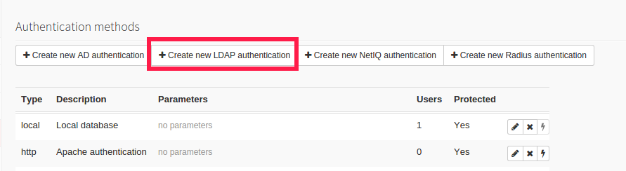
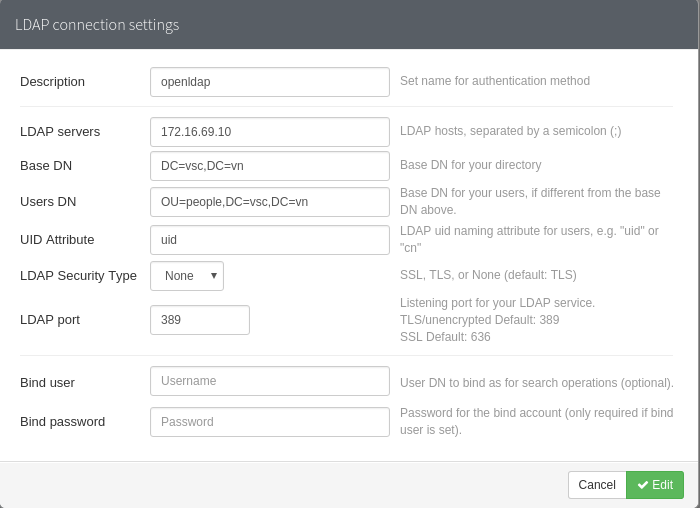
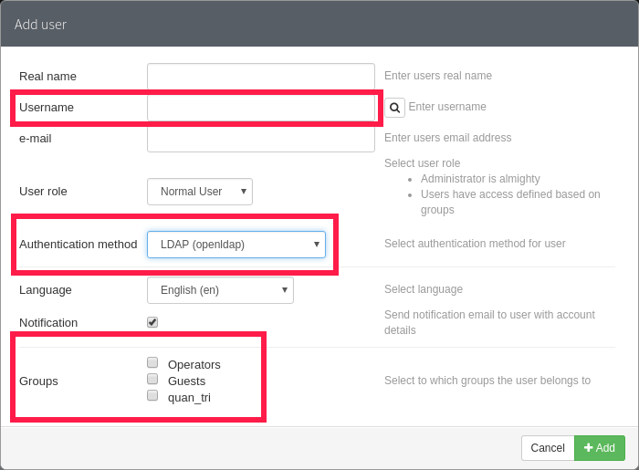

####Cấu hình LDAP cho PHP-IPAM

- Hiện tại PHP-IPAM hỗ trợ 6 phương thức cho việc xác thực
  - Local Authentication
  - Apache Authentication
  - AD
  - LDAP
  - NetIQ
  - Radius

- Ở bài này mình sẽ tích hợp LDAP vào PHP-IPAM, LDAP ở đây có thể là OpenLDAP hoặc FreeIPA

- Chuẩn bị

  - PHP-IPAM
  - OpenLDAP hoặc FreeIPA

- Có một cái không hay của phpipam so với Graylog hay Grafana mình đã cấu hình ở bài trước đó là nó không tự ánh xạ toàn bộ users và groups trên LDAP sang phpipam. Do vậy ta cần phải khai báo từng user thuộc LDAP Server nào.

#####Cấu hình

- Đăng nhập vào  php-ipam bằng tài khoản `admin`

- Chọn *Administration* -> *Authentication methods*

- Ở đây ta chọn *Create new LDAP authentication*

  - Description: Đây là phần mô tả cho LDAP
  - LDAP servers: IP hoặc hostname của LDAP Server , ta có thể khai báo nhiều LDAP Server ngăn cách nhau bằng `;` (chấm phẩy)
  - Base DN: Base DN của LDAP Server
  - Users DN: User DN của LDAP Server khi php-ipam query tới để xác thực user
  - UID Attribute: thuộc tính để xác thực user. Ví dụ nếu ta dùng `uid` để định danh từng user trên LDAP thì ở đây ta điền `uid` còn dùng `cn` thì ta điền `cn`
  - LDAP Security Type: Có 3 lựa chọn: None, TLS, SSL tùy thuộc vào kiểu bảo mật của LDAP Server
  - LDAP Port: Port của LDAP Server
  - Bind user/Bind Password: Là user dùng để thực hiện việc search trong LDAP Server. Phần này có thể có hoặc không.

- Nhấn Add để thêm LDAP Server

- Tiếp theo ta sẽ add user vào theo username trên LDAP Server

- Chọn *Administration* -> *Users*

- Nhấn Create user

- Ở đây ta cần chú ý vào 3 mục

  - Username: Chính là username trên LDAP Server
  - Authentication method: Chọn phương thức xác thực đã tạo ở trên. (Dựa vào Description)
  - Groups: Chọn group mà user này thuộc về để phân quyền

- Nhấn `Add` lúc này ta có thể logout ra và login lại bằng user mới theo mật khẩu trên LDAP Server
