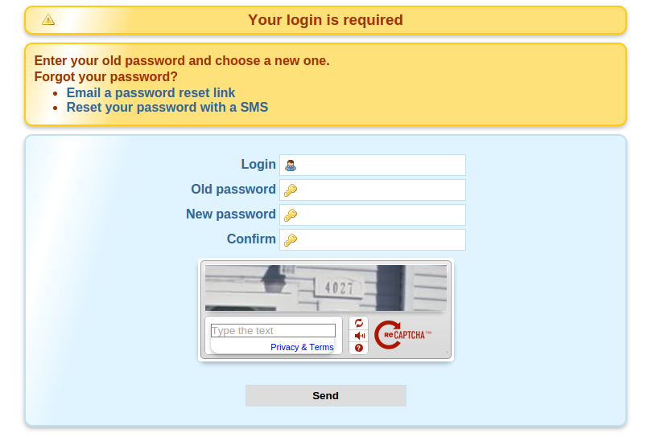
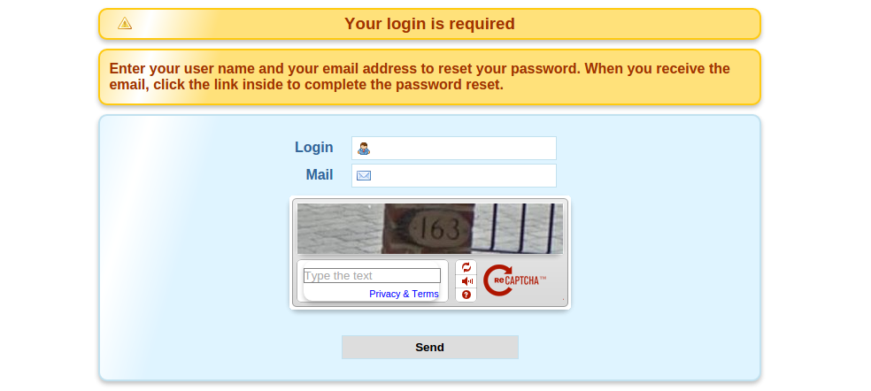
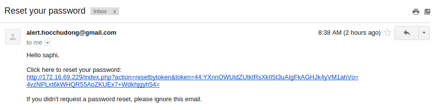
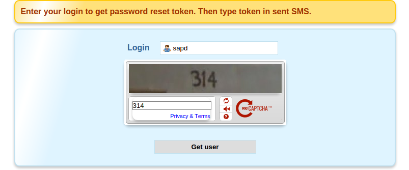
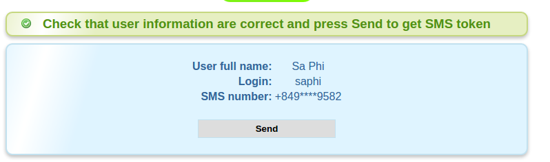
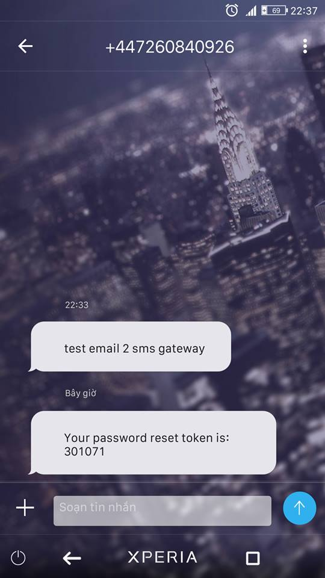

###Cấu hình Self Reset Password

- Mặc định các software(OpenLDAP, FreeIPA) triển khai LDAP đều không hỗ trợ việc user reset password khi bị quên. Và việc này thường do bên thứ 3 phát triển. Mình cũng có test 1-2 sản phẩm khác nhau nhưng hiện tại thấy OK nhất là dùng của [http://ltb-project.org/](LTB project).

- Self Service Password có một số tính năng chính sau

  - Reset Password bằng Token Mail
  - Reset Password bằng Câu hỏi Bí Mật
  - Reset Password bằng SMS Token
  - Hỗ trợ Google Captcha
  - Hỗ trợ Debian/RPM

- Ở bài này ta sẽ sử dụng phương pháp token Mail và Token SMS.

###Cài đặt

- Chuẩn bị

  - Ubuntu Server 14.04
  - LDAP Server (OpenLDAP hoặc FreeIPA)

- Tải file `deb` mới nhất trên trang chủ

`wget http://tools.ltb-project.org/attachments/download/801/self-service-password_0.9-1_all.deb`

- Cài đặt

`sudo dpkg -i self-service-password_0.9-1_all.deb`

- Lúc này nó sẽ yêu cầu cài đặt một số package như `apache2 php5 php5-ldap php5-mcrypt`

- Nhấn `Y` để cài đặt.

- Sau khi cài đặt xong ta rename file config self-service-password của apache2

`mv /etc/apache2/sites-available/self-service-password /etc/apache2/sites-available/self-service-password.conf`

- Sửa ServerName thành IP Server của bạn

```
<VirtualHost *:80>
	ServerName 172.16.69.229

	DocumentRoot /usr/share/self-service-password
	DirectoryIndex index.php

	AddDefaultCharset UTF-8

	LogLevel warn
	ErrorLog /var/log/apache2/ssp_error.log
	CustomLog /var/log/apache2/ssp_access.log combined
</VirtualHost>

```
- Enable File cấu hình

`a2ensite self-service-password`

- File cấu hình Sẽ nằm dường dẫn  `/usr/share/self-service-password/conf/config.inc.php`
####Cấu hình kết nối tới LDAP Server

- Mở file cấu hình và tìm các cấu hình như sau, tùy thuộc vào LDAP Server Của bạn

```
# LDAP
$ldap_url = "ldap://172.16.69.35:389";
$ldap_starttls = false;
$ldap_binddn = "uid=admin,cn=users,cn=accounts,dc=local,dc=domain";
$ldap_bindpw = "P4ssw0rD";
$ldap_base = "cn=accounts,dc=local,dc=domain";
$ldap_login_attribute = "uid";
$ldap_fullname_attribute = "cn";
$ldap_filter = "(&(objectClass=person)($ldap_login_attribute={login}))";

```
- Ta có thể truy cập vào IP Server chạy self-service-password để test thử việc change password



####Cấu hình Reset Password bằng cách gửi token qua mail

- Mặc định nó sẽ dùng mail server domain của bạn. Mình sẽ modify để sử dụng gmail cho việc gửi token qua email ;)

- Cài đặt các package PHP hỗ trợ việc gửi mail

```
apt-get install php-pear
pear install Mail-1.3.0
pear install pear/Net_SMTP
pear install pear/Auth_SASL              
```

- Mở file `/usr/share/self-service-password/lib/functions.inc.php`

  - tìm dòng `function send_mail($mail, $mail_from, $subject, $body, $data)` và sửa thành `function send_mail_old($mail, $mail_from, $subject, $body, $data)`

  - Sau đó add đoạn code gửi mail mới vào

  ```
    function send_mail($mail, $mail_from, $subject, $body, $data) {

      $result = false;

  	/* Those 4 variables should be in Config */
      $host     = "ssl://smtp.gmail.com";
      $port     = "465";
      $username = "your.address@gmail.com";
      $password = "YourSecretPassword";

      if (!$mail) {
          error_log("send_mail: no mail given, exiting...");
          return $result;
      }

      /* Replace data in mail, subject and body */
      foreach($data as $key => $value ) {
          $mail = str_replace('{'.$key.'}', $value, $mail);
          $mail_from = str_replace('{'.$key.'}', $value, $mail_from);
          $subject = str_replace('{'.$key.'}', $value, $subject);
          $body = str_replace('{'.$key.'}', $value, $body);
      }

      /* Encode the subject */
      //mb_internal_encoding("UTF-8"); // couldn't make this work
      //$subject = mb_encode_mimeheader($subject);

      /* Set encoding for the body */
      $header = "MIME-Version: 1.0\r\nContent-type: text/plain; charset=UTF-8\r\n";

      /* Send the mail */
      $headersz = array(
          'From'    => $mail_from,
          'To'      => $mail,
          'Subject' => $subject
      );
      $smtp = Mail::factory('smtp', array(
          'host'     => $host,
          'port'     => $port,
          'auth'     => true,
          'username' => $username,
          'password' => $password
      ));
      $mailz = $smtp->send($mail, $headersz, $body);

      if (PEAR::isError($mailz)) {
          $result = $mailz->getMessage();
      } else {
          $result = true;
      }

      return $result;

  }

  ```

  - Save lại

- Vào trang self-service-password chọn option `Email a password reset link`



- ta nhập username và email của User cần reset và nhấn Send. Nếu nhập đúng ta check mail và sẽ có mail tương tự như sau



- Nhấn vào link và tiến hành đổi Password

####Cấu hình Reset Password bằng cách gửi token qua SMS

- Để sử dụng tính năng này ta cần đăng ký dịch vụ `Email 2 SMS Gateway`

- Có một số nhà cung cấp có cho dùng thử dịch vụ này và hỗ trợ một số nhà mạng ở VN. Mình dùng thằng này [http://txtlocal.co.uk](txtlocal)

- Ta đăng ký và enable tính năng `Email 2 SMS Gatewway` và add email được phép gửi SMS

- Mở file cấu hình ta tìm đoạn cấu hình như sau

```
## SMS
# Use sms
$use_sms = true;
# GSM number attribute
$sms_attribute = "homePhone";
# Partially hide number
$sms_partially_hide_number = true;
# Send SMS mail to address
$smsmailto = "{sms_attribute}@txtlocal.co.uk";
# Subject when sending email to SMTP to SMS provider
$smsmail_subject = "Provider code";
# Message
$sms_message = "{smsresetmessage} {smstoken}";

# SMS token length
$sms_token_length = 6;

```

- Trở lại dashboard chọn options `Reset your password with a SMS`

- Ta nhập user và nhấn get User



- Nếu có user trong hệ thống sẽ hiển thị như sau. Nhấn send để lấy token



- Có được token ta có thể sử dụng để reset password


