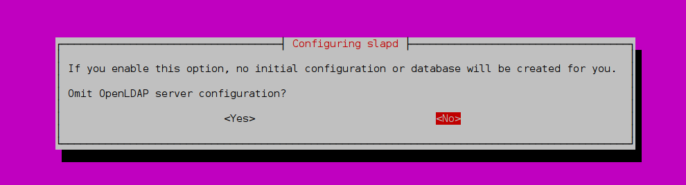
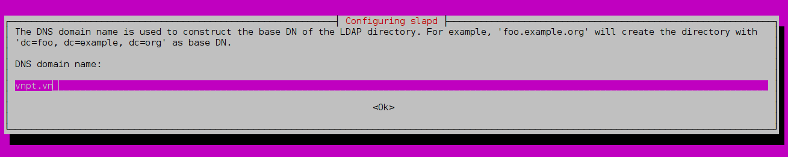
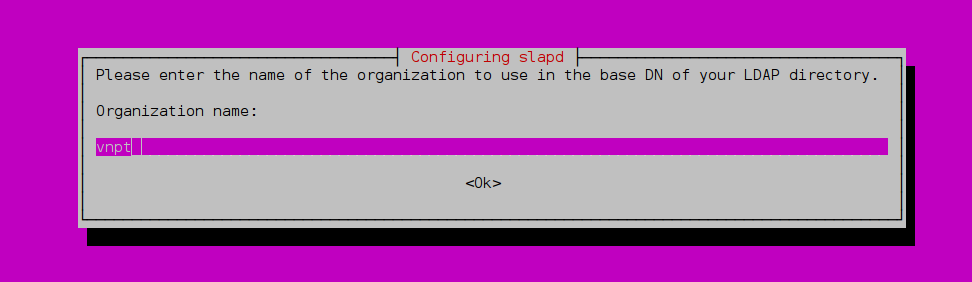
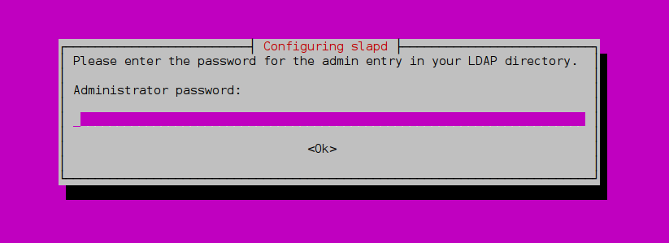
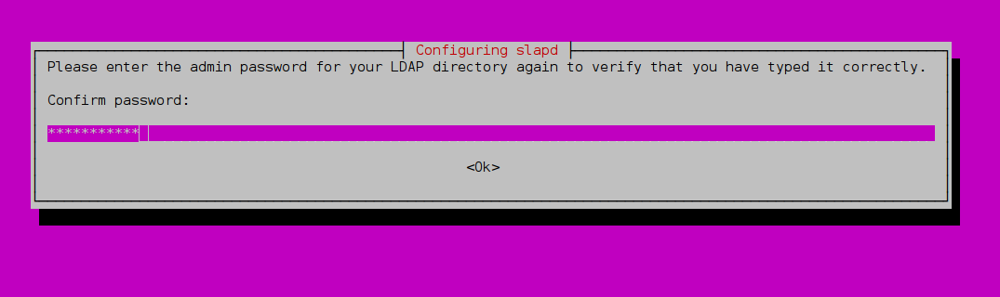
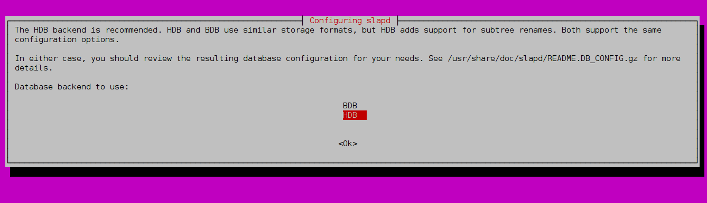
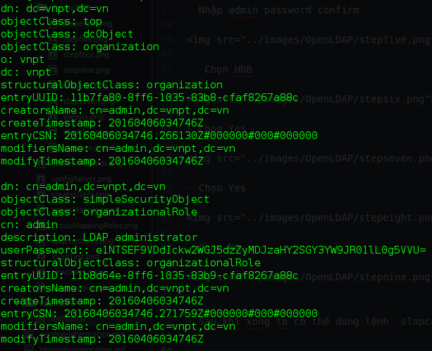
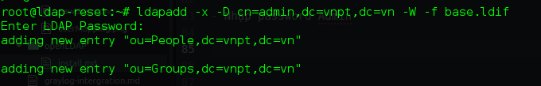

####Cài đặt OpenLDAP

- Chuẩn bị

  - Ubuntu Server 14.04

- Update Repo

`sudo apt-get update && apt-get upgrade -y`

- Cài đặt OpenLDAP

`sudo apt-get install -y slapd ldap-utils`

- ở bước cài đặt này OpenLDAP Sẽ hỏi password admin của LDAP Server. Ta có thể bỏ qua hoặc nhập vào

- Sau khi cài đặt xong ta cấu hình lại LDAP

`sudo dpkg-reconfigure slapd`

- Chọn No



- Nhập vào domain



- Nhập vào Tên tổ chức



- Nhập admin password



- Nhập admin password confirm



-  Chọn HDB



- Chọn Yes


- Chọn Yes


- Chọn No


- Sau khi xong ta có thể dùng lệnh `slapcat` để kiểm tra lại các thông tin



- Tạo OU People chứa các user và OU Groups chứa các nhóm

- Sử dụng file ldif có nội dung như sau

```
dn: ou=People,dc=vnpt,dc=vn
objectClass: organizationalUnit
ou: People

dn: ou=Groups,dc=vnpt,dc=vn
objectClass: organizationalUnit
ou: Groups

```

- Lưu với tên base.ldif

- Add vào LDAP Server

`ldapadd -x -D cn=admin,dc=vnpt,dc=vn -W -f base.ldif`

- Nhập password Admin




####Cấu hình chặn anon user query LDAP Server

- Tạo một file ldif có nội dung như sau

`vi /usr/share/slapd/ldap_disable_bind_anon.ldif`

```
dn: cn=config
changetype: modify
add: olcDisallows
olcDisallows: bind_anon

dn: cn=config
changetype: modify
add: olcRequires
olcRequires: authc

dn: olcDatabase={-1}frontend,cn=config
changetype: modify
add: olcRequires
olcRequires: authc

```

- Add vào LDAP Server

`ldapadd -Y EXTERNAL -H ldapi:/// -f /usr/share/slapd/ldap_disable_bind_anon.ldif`
